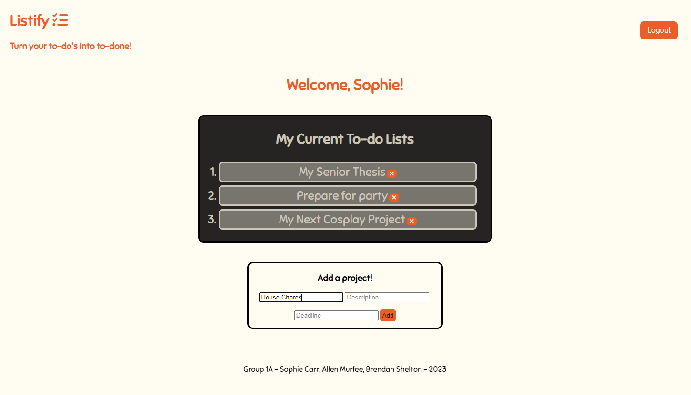

# ***Listify***: A To-Do List App

  ## Table of Contents
  - [Description](#description)
  - [Screenshot](#screenshot)
  - [Deployed Site](#deployed-link)
  - [Technologies Used](#technologies-used)
  - [Usage](#usage)
  - [Collaborators](#collaborators)

  ## Description
  For our final class project we were assigned to create a MERN stack application from scratch. Our team chose to create a simple to-do list app called Listify. Our app provides a simple way for users to create and organize their to-do lists. From school projects to event planning to simple household chores - Listify makes it easy to arrange the users tasks as ‘haven’t started’, ‘in progress’, or ‘done’! Our app uses React on the front end, GraphQL with a Node.js and Express.js server, and MongoDB for the database.

  ## Screenshot
  

  ## Deployed Link
  <a href="https://young-island-68053.herokuapp.com/">Link to Deployed App</a>
  
  ## Technologies Used
  
  
   
  
  
   
  
  
   
  
  
  

  ## Usage
  App is free to use. Follow the deployed link
  
  ## Collaborators
  Allen Murfee - <a href="https://github.com/allenmurfee">Github Profile</a> 
  Brendan Shelton - <a href="https://github.com/BrendanShelton">Github Profile</a> 
  Sophie Carr - <a href="https://github.com/pinkywiththebrain">Github Profile</a>